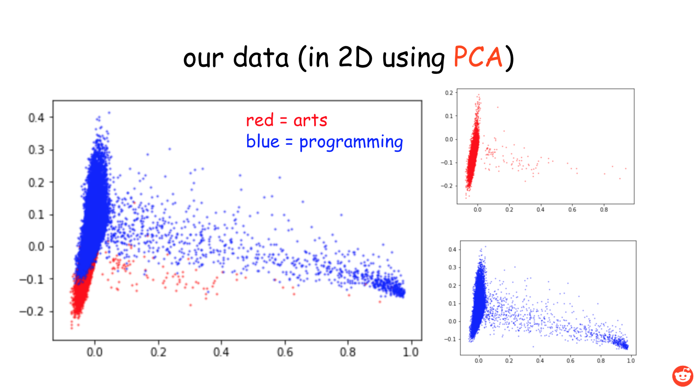
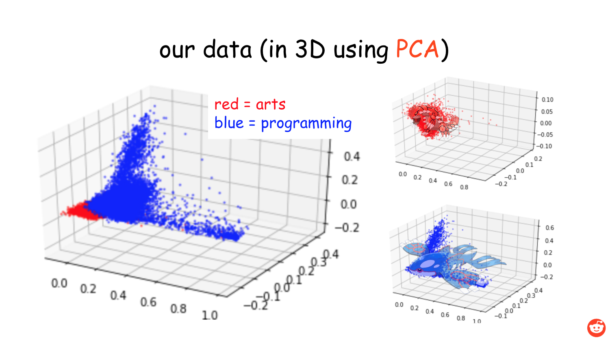
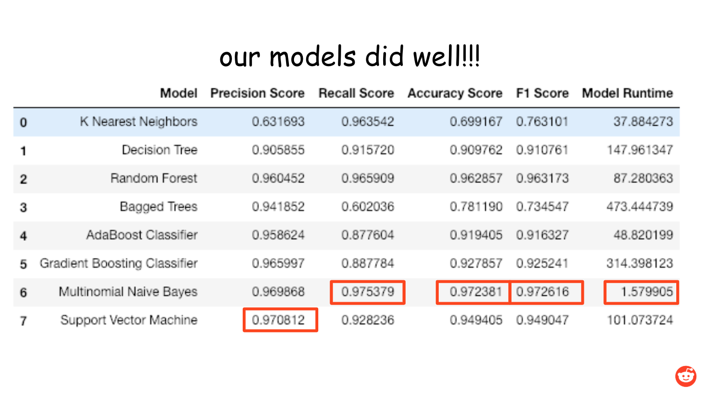
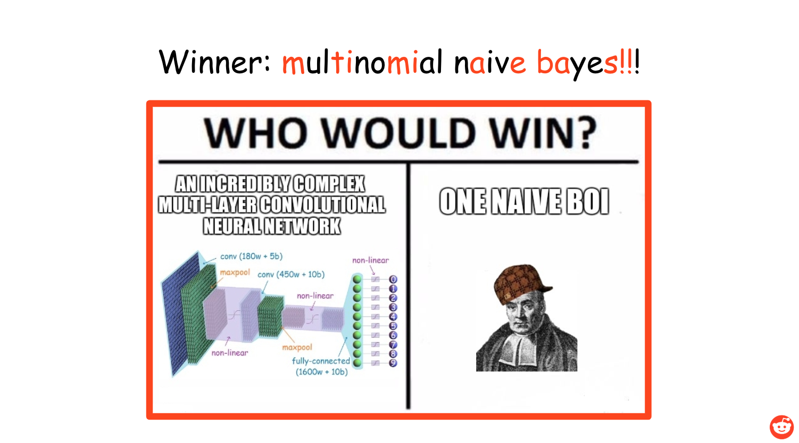

# Predicting the Category of Text Posts

## Goal
Build a classifier that predicts whether a text is more closely related to **art** or **programming**. This classifier would be trained on Reddit posts.

## Data Cleaning

- We started with a dataset from Kaggle that manually tagged the category of subreddits
- We selected 21 subreddits classified as **arts** and 21 subreddits classified as **programming**, and took 1000 posts from each of the subreddits to form a balanced dataset of 42,000 posts

## Data Preprocessing / Feature Engineering
Given clean, merged data, we used NLTK to tokenize, lemmatize and filter the data, giving us 95,000 unique features (words). From there we vectorized the data via TF-IDF calculation and dropped words below a threshold of 0.0001, words such as 'abcdefghijklmnopqrstuvwxyz'. This left us with around 5,000 words to model!

## Visualization of Data in Reduced Dimensions

## Performance of ML Models

## Winner Winner Chicken Dinner!

