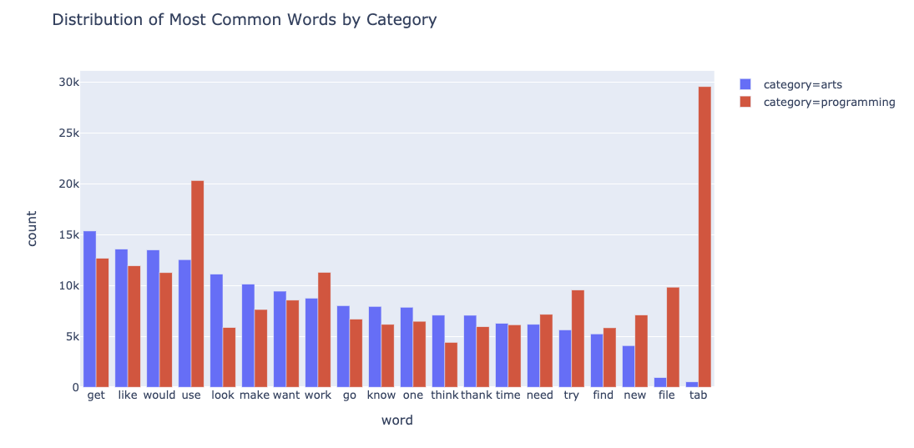
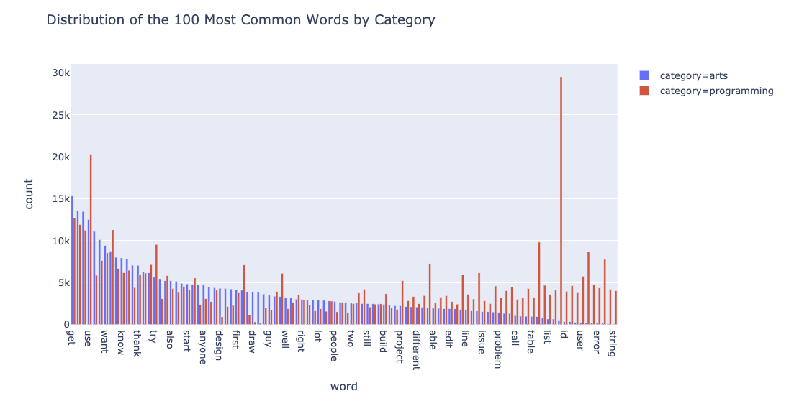
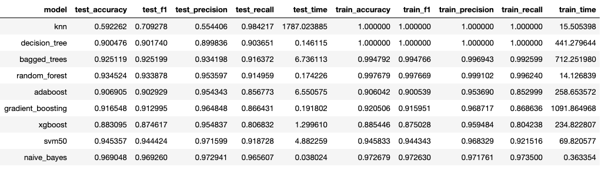

# Predicting the Category of Text Posts

## Goal
Build a classifier that predicts whether a text is more closely related to **art** or **programming**. This classifier would be trained on Reddit posts.

## Data Cleaning

- We started with a dataset from Kaggle that manually tagged the category of subreddits
- We selected 21 subreddits classified as **arts** and 21 subreddits classified as **programming**, and took 1000 posts from each of the subreddits to form a balanced dataset of 42,000 posts

## Data Preprocessing / Feature Engineering
Given clean, merged data, we used NLTK to tokenize, lemmatize and filter the data, giving us 95,000 unique features (words). From there we vectorized the data via TF-IDF calculation and dropped words below a threshold of 0.0001, words such as 'abcdefghijklmnopqrstuvwxyz'. This left us with around 5,000 words to model.

## Exploratory Data Analysis
Before any modeling, we wanted to see what the data across the two categories of posts looked like.

### 1. Distribution of the Overall Top 20 Words Across Both Categories

### 2. Distribution of the Overall Top 100 Words Across Both Categories

## Visualization of Data in Reduced Dimensions
To get an overall view of the data points, we reduced the dimensionality of the data using Principal Component Analysis and visualized the data in 2D and 3D.

## Performance of ML Models
In total, we trained and tested 9 machine learning models typically used for classification. Based on the training metrics, testing metrics and time, we decided on the **Multinomial Naive Bayes** model to be our final model. 

